# S1M — architecture and system design

Status: proposed full design, version 0.1, 2026-09-19. S1M is an independently packaged prediction runtime and offline training/calibration pipeline for registered SDLC tasks. Its consumer may be S1Router or a direct application.

## Architecture choice

Use a small pretrained encoder with task-specific decision heads as the custom-model reference architecture. Establish a sparse linear classifier baseline and a replaceable Laya integration before investing in fine-tuning. Laya's API is an adapter target, not the internal domain model. Do not invoke Laya's automatic multi-checkpoint routing as an implicit substitute for S1Router policy.

A task-conditioned option scorer can be evaluated later, but version 1 does not promise zero-shot arbitrary question semantics. Registered tasks have immutable labels, instructions, input fields and rubrics. Head changes are task/model version changes.

This bounded model is a deliberate engineering choice. Domain ownership follows [DDD](https://martinfowler.com/bliki/BoundedContext.html); interfaces isolate research/runtime dependencies using [ports/adapters](https://alistair.cockburn.us/hexagonal-architecture).

```mermaid
flowchart LR
    Sources[Licensed open / reviewed synthetic examples] --> Data[Validate provenance and labels]
    Data --> Split[Freeze group-aware split manifests]
    Split --> Train[Train on train; tune on validation]
    Train --> Candidate[Candidate checkpoint]
    Candidate --> Cal[Fit calibration on calibration split]
    Cal --> Test[Once-only final test and resource measurements]
    Test -->|pass| Bundle[Immutable release bundle]
    Test -->|fail| Experiment[Retain experimental report]
    Bundle --> Runtime[Offline inference runtime]
    Runtime --> Consumer[Canonical distributions to caller]
```



## Bounded contexts and aggregates

| Context | Model and invariant |
| --- | --- |
| Task catalog | TaskDefinition aggregate: version, state schema, language, labels/rubrics, allowed uses; changing semantics creates a new version |
| Dataset curation | DatasetVersion aggregate: source rights, immutable example IDs, label provenance, group lineage and split assignment |
| Training | ExperimentRun aggregate: code/environment/config/data digests, seed, checkpoints and metrics; outputs do not overwrite prior runs |
| Calibration and evaluation | CalibrationProfile and EvaluationReport: exact artifact/task identity and split role; final-test labels cannot be tuning input |
| Artifact registry | ModelBundle aggregate: file checksums, manifest, compatibility, licensing, measured support envelope and release status |
| Inference | PredictionBatch value and RuntimeSession lifecycle: verified load, bounded execution, typed output or explicit unsupported/error result |

Training/evaluation are not dependencies of deployed inference. The model has no access to router policy, remote credentials or workflow actions. A shared contract is the only required consumer coupling.

## Repository and interfaces

```text
packages/model/src/s1m/
  domain/        # task, dataset, bundle and evidence metadata
  application/   # curate, train, calibrate, evaluate, export, predict
  ports/         # encoder, tokenizer, artifact store, experiment store
  adapters/      # torch, laya, safetensors, local files
  inference/     # preprocessing, batching, prediction conversion
  cli/           # data, train, calibrate, eval, export, doctor
```

Pure dataset validators and metrics can run without downloading weights. `Predictor.capabilities()` returns registered task hashes and limits; `predict(state, questions)` returns canonical distributions with provenance. It has no routing accept/escalate decision. Consumer policy must decide whether a calibrated prediction is acceptable.

## Input representation and heads

State fields are selected by task schema and serialized deterministically. Preprocessor version records field order, Unicode policy, separators and normalization. Token count includes special tokens, question text, option descriptions and rubric—not merely the issue body. Excessive state/head input fails explicitly; truncation is disabled.

Custom reference heads:
- Choice: one logit per immutable class; softmax yields complete ordered support.
- Bool: two logits, false then true; P(true) is the second softmax probability.
- Score: one logit per finite ordered level; return distribution, argmax and expected numeric level. Cross-entropy is the initial training loss; report ordinal MAE separately. Ordinal loss experiments require an ADR and comparison.

For multiple registered tasks on identical state, reuse compatible encoder work where semantics permit, then evaluate independent heads. This is bounded computation, not a promise of constant cost or one universal forward pass for arbitrary questions. Question dependencies are rejected; callers express sequential workflows outside the model.

## Dataset design and training

Example fields: example_id, group_id, source_uri, source_revision, source_license, collected_at, task_id/version, language, state, label, label_origin, reviewer_ids, adjudication_status and content_hash. Never store credentials or confidential employer data in the public dataset.

Split by repository/issue lineage and duplicate/template clusters before training. Proposed fractions: 70% train, 10% validation, 10% calibration, 10% final test, with group integrity taking precedence over exact ratios. Validate label/language coverage and temporal leakage. Allocate enough reviewed final-test examples to satisfy statistical support requirements; a split percentage alone is insufficient.

Use train for gradient updates, validation for architecture/epoch/learning-rate selection, calibration for temperature and routing-threshold selection, and test once for the frozen candidate. Repeated development against failed final tests requires a newly versioned untouched test set. Teacher-distilled labels carry origin and cannot silently become human truth.

Start with a frozen encoder and trained head. Fine-tune upper layers or LoRA only when validation evidence justifies cost. Optimizer, schedule, precision, seed, determinism flags, hardware and library lock are recorded in the run. Local training is optional; cloud compute requires explicit budget authorization.

## Calibration, evaluation and uncertainty

Fit one positive scalar temperature per supported task using held-out logits and NLL. Store method/version, fit split digest, pre/post metrics and complete artifact identity. No calibration identity survives changed weights, quantization, tokenizer, preprocessor or label definitions without new evidence. [Calibration methodology](https://proceedings.mlr.press/v70/guo17a.html)

Metrics: accuracy and macro-F1; confusion matrix; NLL with a documented numeric epsilon; multiclass Brier defined as mean sum of squared class errors; 15-bin equal-width top-label ECE; classwise reliability; ordinal MAE and within-one accuracy for Score; positive-class Brier and false-positive/false-negative rates for Bool. Report bootstrap intervals for descriptive metrics and exact one-sided binomial risk bound for acceptance.

Risk = erroneous accepted predictions / accepted predictions. Coverage = accepted predictions / all eligible test predictions. Report separate slice support and abstention reasons; zero accepted means undefined risk and release failure, not zero risk. [Selective classification](https://arxiv.org/abs/1705.08500)

Out-of-envelope rejection checks known task, language declaration and verified language support, size, schema and artifact identity. Language identification can be uncertain; uncertain language abstains. These checks do not claim general semantic OOD detection. Evaluate adversarial phrasing, mixed intent, negation and prompt-like instructions as slices.

## Artifact lifecycle and serving

Bundle: manifest.json, model.safetensors or approved equivalent, tokenizer assets, task registry, preprocessing config, calibration.json, acceptance profile, evaluation report, model card and third-party notices. Manifest lists every relative file path, byte size and SHA-256; prohibit path traversal/symlinks during unpack. Artifact_ref identifies immutable registry revision and manifest digest.

Install to a staging directory, verify all entries, run a local smoke fixture, and atomically activate. Preserve previous verified bundle for rollback. A checksum detects corruption; source authenticity also requires a trusted registry or trusted expected digest. No arbitrary remote code execution or pickle-based checkpoint loading from untrusted artifacts.

CPU is the reference compatibility lane. MPS and CUDA are optional measured lanes. MLX/GGUF/ONNX support requires an actual compatible export/runtime test; none is inferred from model size. Quantization is a new candidate with new calibration and quality/resource evidence.

Warm session owns one loaded checkpoint on the reference laptop; concurrency one, bounded queue managed by caller/runtime, batched questions capped by capability. Unload returns to an unloaded state; report Python/runtime baseline memory separately. Hardware/framework differences can prevent bitwise reproducibility. [PyTorch](https://docs.pytorch.org/docs/main/notes/randomness.html)

## Training, installation and scoring are separate stages

Production readiness does not mean training or downloading during scoring. The lifecycle is: acquire a pinned licensed base model if needed; train/fine-tune on approved training data; select on validation; calibrate on a separate calibration split; evaluate the frozen candidate on untouched reviewed final data; export and verify; explicitly install; then serve offline inference. A trained baseline may qualify if it meets the same task-quality and operational gates; a larger encoder is not automatically production-ready.

The current sparse numerical implementation and hand-authored test weights validate software behavior only. They are not a trained SDLC release. `experimental_fixture` is deliberately ineligible for production promotion. Reference architecture and lifecycle requirements remain unchanged. See [model acceptance](spec.md), [full delivery plan](../engineering/full-router-plan.md), [Transformers offline loading](https://huggingface.co/docs/transformers/installation#offline-mode), and [calibration research](https://proceedings.mlr.press/v70/guo17a.html).

Serving reuses verified weights; it does not update them from user requests. Consented feedback may feed a separate, versioned future training run. Any new weights or quantization require fresh calibration/evaluation and a controlled installation with rollback before taking traffic. The production gates apply to the precise deployed artifact, task envelope and hardware, including accepted-error risk/coverage, unsupported-input behavior, time/memory limits and observation/maintenance evidence.

## Release and monitoring

States: experimental → validated → candidate → released → deprecated/revoked. Only release evidence can promote a bundle; inference cannot promote or retrain it. Retain data/model/code lineage and rollback compatibility. Drift monitoring uses consented reviewed outcomes and observed error/coverage changes; distribution alarms initiate review rather than automatic retraining.

Source of truth: [spec](spec.md), [intent](intent.md), [shared contract](../contracts/decision-v1.md), [ADR register](../decisions.md), and [sources](../sources/README.md). Full production scope requires evidence at the actual deployed precision and hardware.

## Progressive delivery and operational scope

The owner-directed [layered delivery and NFR matrix](../engineering/layered-delivery.md) is part of this product design. Every delivered layer must build, test, deploy locally, observe and maintain its actual capabilities. Full-product readiness is not required to release a clearly scoped local layer; model quality and all future capabilities remain separately gated.

Model NFR ownership: per-artifact load/preprocess/inference latency, process-tree memory, precision and failure telemetry; no raw examples in logs. One resident model and bounded batches first; caller manages admission/backpressure. Additional workers require measured memory headroom and runtime-quality parity. Calibration and task-support alarms disable automatic acceptance; they cannot trigger unreviewed retraining. Immutable model/calibration bundles support local rollback independently of router code.

## Optional active-learning research

[ADR-014](../decisions.md) allows L4 experiments inspired by jev-align: uncertainty sampling plus seeded exploration, human labels, candidate history and rewind. Keep optimization, calibration, validation and untouched final-test data separate with group/duplicate lineage checks. Repeatedly inspected holdout performance is development evidence. Prompt candidates receive new task-definition hashes and invalidate prior calibration; training and reflection remain outside inference. Input capture is opt-in under data-class, redaction, access and retention policy; drops are observable and disposable capture is never a durable audit substitute. Evidence and limitations: [pinned comparison](../research/jev-projects-comparison.md).

## Mandatory code-quality constraints

Owner-directed [CQ-001–CQ-004](../engineering/code-quality.md) apply to this product: SOLID responsibilities and dependency inversion, narrow substitutable ports, fewer than 250 physical lines per production source file, and justified patterns without speculative abstraction. Mechanical size/import checks run in every local gate; independent semantic review records design rationale and behavioral evidence. Resource bounds and scalability follow the progressive NFR design; a small file alone proves neither. Source decision: [ADR-015](../decisions.md).
