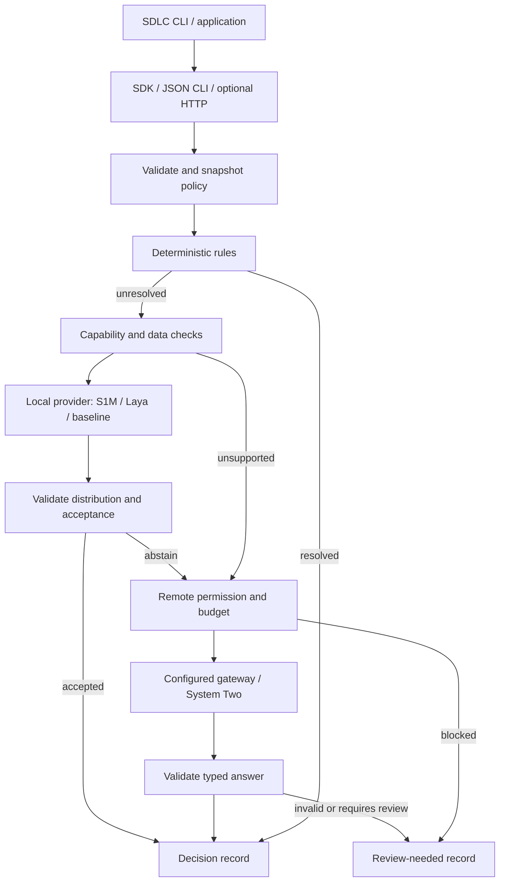

# S1Router — architecture and system design

Status: proposed full design, version 0.1, 2026-09-19. S1Router routes typed decisions among deterministic code, supported prediction providers, optional remote reasoning, and review. It never executes the recommended workflow.

## Context and architectural choice

Use a Python modular monolith with separate distributable packages: `s1_contracts`, `s1router`, and optional `s1m`. The router depends on contracts and provider protocols, not on tensor libraries. SDLC callers communicate via SDK or JSON CLI. A future internal service wraps the same application use case.

This is a project application of bounded contexts and ports/adapters. A context is a domain ownership boundary, not a requirement to deploy a separate service. [D1](https://martinfowler.com/bliki/BoundedContext.html), [D2](https://alistair.cockburn.us/hexagonal-architecture)



## Domain model and context map

| Context | Ownership and invariants |
| --- | --- |
| Decision contracts, shared kernel | Immutable request, question, distribution, terminal result; stable IDs and complete support |
| Routing policy, router core | PolicySnapshot aggregate with version/hash, ordered providers, thresholds, deadlines, allowed data classes; validated atomically |
| Decision execution, router application | DecisionRun aggregate, per-question state machine, immutable attempt records, one final outcome per question |
| Provider integration, anti-corruption layer | Translates vendor responses into canonical types; cannot invent calibration or relax policy |
| Evidence and audit, supporting context | Redacted append-only records and replay references; no raw state by default |
| S1M, external bounded context | Publishes capabilities and predictions with immutable artifact identities; owns training/calibration |
| Workflow execution, external context | Owns authorization, actions, human review, and application retries |

Value objects include TaskRef, QuestionId, ProbabilityVector, ArtifactRef, MoneyBudget, Deadline, DataClass and ReasonCode. A selected label is not an entity or a mutable aggregate. Rules and capability matching are pure functions. Avoid generic repositories for values that need no persistence.

## Modules and dependency direction

```text
packages/contracts/src/s1_contracts/
packages/router/src/s1router/
  domain/          # state transitions, policies, acceptance, values
  application/     # decide, replay, validate configuration
  ports/           # provider, audit sink, clock, budget ledger, registry
  adapters/        # rules, local process, remote HTTP, file audit
  cli/             # transport and exit codes only
packages/model/src/s1m/   # independently released model subsystem
```

The domain imports only standard library and shared contracts. Application imports domain and ports. Adapters implement ports; the composition root wires them. Runtime credentials, filesystem paths, network clients, and PyTorch never enter domain objects. Import boundaries receive architectural tests.

Ports: `DecisionProvider.capabilities()`, `evaluate(batch, deadline)`, `AuditSink.append(record)`, `Clock.monotonic()`, `BudgetLedger.reserve/settle()`, and `TaskRegistry.resolve(task_ref)`. Providers are configured explicitly; arbitrary runtime plugin imports are excluded.

## Request lifecycle and failure handling

1. Validate the whole envelope before I/O, including unique question IDs and payload limits.
2. Snapshot policy, task registry and provider identities once. Later configuration changes affect new runs.
3. Apply mandatory review policy, then ordered rules to each question. Conflicting same-priority rules produce review-needed, not an arbitrary winner.
4. Check local task/schema/rubric hash, language, data eligibility, token/option budgets, artifact health, and calibration profile. Do not silently truncate inputs.
5. Batch only compatible independent questions with identical state/preprocessor/artifact. Validate outputs per question; preserve original order.
6. Accept a prediction only if its support, calibration identity, threshold, margin, and task-risk policy pass. Uniform or fabricated distributions are errors, not fallback answers.
7. For unresolved questions, check remote permission, endpoint allowlist, classification, remaining deadline and reserved cost. Call the next configured provider at most once; no recursive routing.
8. Validate the remote typed answer. Generated confidence is not calibrated confidence. Low-risk policy may allow a valid remote answer as `answered_remote`; default policy requires review.
9. Return all final results, persist redacted attempts, and settle the budget even on cancellation.

Invalid envelope is a request error. A provider failure is isolated to its unresolved questions. Timeout/cancellation prevents late results from replacing a terminal outcome. Mandatory audit failure blocks release of automatic answers when `audit_required=true`.

## Acceptance semantics

Choice uses calibrated top probability and a configurable top-two margin. Bool applies the same gate to `max(p_true, 1-p_true)`; action thresholds and confidence thresholds are separate. Score uses a full finite ordinal distribution: top-bin confidence governs exact-bin acceptance; expected value is descriptive and never presented as the probability of being correct. Confidence equality passes; ties select declaration order for display but fail any positive margin gate.

Calibration identity binds task/rubric, checkpoint, precision, tokenizer, preprocessor, and calibration dataset. Quantization changes identity. Unknown support is grounds to abstain. Temperature calibration helps within an evaluated distribution; it does not certify out-of-distribution inputs. [M3](https://proceedings.mlr.press/v70/guo17a.html)

## Deployment, resources, and operations

Default SDK is in-process. CLI offers a persistent local worker using length-bounded JSON lines over stdin/stdout; logs go to stderr. The worker loads one checkpoint, rejects oversized frames, bounds queue to 32 requests and concurrency to one inference on the reference laptop. Startup readiness is published only after manifest verification and a fixture smoke test. Busy requests receive a typed retryable error.

Optional full-release HTTP hosting binds loopback by default. Non-loopback hosting needs authentication, TLS termination, request size limits and per-principal quotas. Multi-tenant SaaS and distributed scheduling are outside this design.

Model downloads are explicit commands, never an inference side effect. Remote adapters can target an approved Tetrate endpoint, subject to live conformance testing; SDK naming compatibility is insufficient. [G1](https://docs.tetrate.ai/product-architecture/architecture-overview/)

Keep no inference cache initially. Replay can use stored sanitized fixtures or caller-supplied state plus original artifact hashes; it must identify missing data instead of pretending a hash reconstructs input. Record latency separately for queue, load, preprocessing, inference, routing, network and total.

## Security and observability

Treat state, options, descriptions, and remote output as data. Rules are reviewed declarative predicates, never eval strings. Restrict remote endpoints from configuration, not request state. Exclude secrets/raw prompts from default logs; keyed hashes are optional, not claimed anonymization. Retention defaults to seven days for local metadata, with explicit deletion and file permissions.

Track acceptance/review/error rates, reason counts, provider health, p50/p95/p99, cost estimates versus actual reported usage, and artifact versions. Do not put request IDs or labels with uncontrolled cardinality into metrics. Circuit breaking is per provider: five consecutive transient failures open for 30 seconds, then one half-open probe; fake-clock tests cover transitions.

Rollback atomically switches a validated policy/artifact pair to the prior known-good revision. In-flight runs finish on their snapshot. Missing compatible calibration means no local automatic acceptance.

## Source of truth

Requirements and test scenarios: [spec](spec.md). Shared types: [contract](../contracts/decision-v1.md). Product outcomes: [intent](intent.md). Decisions and alternatives: [ADR register](../decisions.md). Context: [C1](../sources/conversation.md). Model benchmark claims are deliberately not architectural guarantees.

## Progressive delivery and operational scope

The owner-directed [layered delivery and NFR matrix](../engineering/layered-delivery.md) is part of this product design. Every delivered layer must build, test, deploy locally, observe and maintain its actual capabilities. Full-product readiness is not required to release a clearly scoped local layer; model quality and all future capabilities remain separately gated.

Router NFR ownership: strict admission and processing latency from L1; bounded redacted events and deterministic observations from L1; token bucket 10 requests/sec with burst 20 in the resident runtime; bounded inference queue 32 from L2; atomic budgets and circuit breaking from L3; per-principal authentication/rate limits before shared serving. Scale from one resident worker only after measured queue or latency pressure, with memory budgets for each added worker. No distributed infrastructure is required for the local CLI.

## Optional provider bridge research

[ADR-014](../decisions.md) keeps LocalJev behind the provider port in L3. Conformance fixtures must exercise external Bool vocabulary, support order, sparse Score mapping, complete keys, unknown task identity, malformed distributions, timeout/error translation, saturation and provenance. Entropy or self-reported confidence must never enable answered_local. Reuse is conditional on the S1 data policy, monotonic deadline and audit boundary; a local bridge URL alone does not prove offline processing. Evidence: [pinned source comparison](../research/jev-projects-comparison.md).

## Mandatory code-quality constraints

Owner-directed [CQ-001–CQ-004](../engineering/code-quality.md) apply to this product: SOLID responsibilities and dependency inversion, narrow substitutable ports, fewer than 250 physical lines per production source file, and justified patterns without speculative abstraction. Mechanical size/import checks run in every local gate; independent semantic review records design rationale and behavioral evidence. Resource bounds and scalability follow the progressive NFR design; a small file alone proves neither. Source decision: [ADR-015](../decisions.md).
